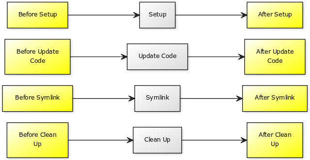

Overview
========

History
-------

[Capistrano](http://capistranorb.com/) is a remote server automation tool and it's currently in Version 3. [Version 2.0](https://github.com/capistrano/capistrano/tree/legacy-v2) was originally thought in order to deploy RoR applications. With additional plugins, you were able to deploy non Rails applications such as PHP and Python, with different deployment strategies, stages and much more. I loved Capistrano v2. I have used it a lot. I developed a plugin for it.

Capistrano 2 was a great tool and it still works really well. However, it is not maintained anymore since the original team is working in v3. This new version does not have the same set of features so it is less powerful and flexible. Besides that, other new tools are becoming easier to use in order to deploy applications, such as Ansible.

So, I have decided to stop using Capistrano because v2 is not maintained, v3 does not have enough features, and I can do everything Capistrano was doing with Ansible. If you are looking for alternatives, check Fabric or Chef Solo.

Project name
------------

Ansistrano comes from Ansible + Capistrano, easy, isn't it?

Ansistrano anonymous usage stats
--------------------------------

There is an optional step in Ansistrano that sends a HTTP request to our servers. Unfortunately, the metrics we can get from Ansible Galaxy are limited so this is one of the few ways we have to measure how many active users we really have.

We only use this data for usage statistics but anyway, if you are not comfortable with this, you can disable this extra step by setting `ansistrano_allow_anonymous_stats` to false in your playbooks.

Who is using Ansistrano?
------------------------

Is Ansistrano ready to be used? Here are some companies currently using it:

* [ABA English](http://www.abaenglish.com/)
* [Another Place Productions](http://www.anotherplaceproductions.com)
* [Aptvision](https://www.aptvision.com)
* [ARTACK WebLab](https://www.artack.ch)
* [Atrápalo](http://www.atrapalo.com)
* [Beroomers](https://www.beroomers.com)
* [CMP Group](http://www.teamcmp.com)
* [Cabissimo](https://www.cabissimo.com)
* [Camel Secure](https://camelsecure.com)
* [Cherry Hill](https://chillco.com)
* [Claranet France](http://www.claranet.fr/)
* [Clearpoint](http://www.clearpoint.co.nz)
* [Clever Age](https://www.clever-age.com)
* [CridaDemocracia](https://cridademocracia.org)
* [Cycloid](http://www.cycloid.io)
* [Daemonit](https://daemonit.com)
* [Deliverea](https://www.deliverea.com/)
* [DevOps Barcelona Conference](https://devops.barcelona/)
* [Durable Programming](https://durableprogramming.com/)
* [EnAlquiler](http://www.enalquiler.com/)
* [Euromillions.com](http://euromillions.com/)
* [Finizens](https://finizens.com/)
* [FloraQueen](https://www.floraqueen.com/)
* [Fluxus](http://www.fluxus.io/)
* [Geocalia](https://geocalia.com/)
* [Gstock](http://www.g-stock.es)
* [HackSoft](https://hacksoft.io/)
* [HackConf](https://hackconf.bg/en/)
* [Hexanet](https://www.hexanet.fr)
* [HiringThing](https://www.hiringthing.com/)
* [Holaluz](https://www.holaluz.com)
* [Hosting4devs](https://hosting4devs.com)
* [Jobbsy](https://jobbsy.dev)
* [Jolicode](http://jolicode.com/)
* [Kidfund](http://link.kidfund.us/github "Kidfund")
* [Lumao SAS](https://lumao.eu)
* [mailXpert](https://www.mailxpert.ch)
* [MEDIA.figaro](http://media.figaro.fr)
* [Moss](https://moss.sh)
* [Nice&Crazy](http://www.niceandcrazy.com)
* [Nodo Ámbar](http://www.nodoambar.com/)
* [Oferplan](http://oferplan.com/)
* [Ofertix](http://www.ofertix.com)
* [Òmnium Cultural](https://www.omnium.cat)
* [OpsWay Software Factory](http://opsway.com)
* [Parkimeter](https://parkimeter.com)
* [PHP Barcelona Conference](https://php.barcelona/)
* [Scoutim](https://scoutim.com/)
* [Socialnk](https://socialnk.com/)
* [Spotahome](https://www.spotahome.com)
* [Suntransfers](http://www.suntransfers.com)
* [TechPump](http://www.techpump.com/)
* [Tienda Online VirginMobile](https://cambiate.virginmobile.cl)
* [The Cocktail](https://the-cocktail.com/)
* [Timehook](https://timehook.io)
* [TMTFactory](https://tmtfactory.com)
* [UNICEF Comité Español](https://www.unicef.es)
* [Ulabox](https://www.ulabox.com)
* [Uvinum](http://www.uvinum.com)
* [VirginMobile Chile](https://empresas.virginmobile.cl)
* [Wavecontrol](http://monitoring.wavecontrol.com/ca/public/demo/)
* [WAVE Meditation](https://wavemeditation.com/)
* [Yubl](https://yubl.me/)
* [AmphiBee](https://amphibee.fr)
* [Hexito](https://hexito.com)

If you are also using it, please let us know via a PR to this document.

Features
--------

* Rollback in seconds (with ansistrano.rollback role)
* Customize your deployment with hooks before and after critical steps
* Save disk space keeping a maximum fixed releases in your hosts
* Choose between SCP, RSYNC, GIT, SVN, HG, HTTP Download or S3 GET deployment strategies (optional unarchive step included)

Main workflow
-------------

Ansistrano deploys applications following the Capistrano flow.

* Setup phase: Creates the folder structure to hold your releases
* Code update phase: Puts the new release into your hosts
* Symlink phase: After deploying the new release into your hosts, this step changes the `current` softlink to new the release
* Cleanup phase: Removes any old version based in the `ansistrano_keep_releases` parameter (see "Role Variables")

